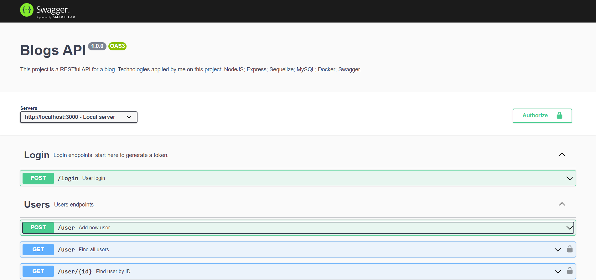
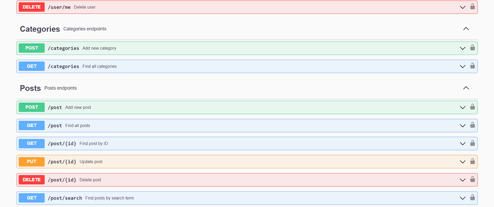

<h1 align="center" height="700">
  Blog-REST-Swagger-Docker
</h1>

## 📋 About
REST API to manage a blog

## ✨ Functionalities 
- Login with email and password
- User CRUD
- Register and list categories
- Post CRUD
- Get post by a query

## 💻 Technologies


## 📦 Running
Start docker-compose
```bash
docker-compose up -d
```
Join docker container
```bash
docker exec -it blogs_api bash
```
Install dependences
```bash
npm i
```
Start server
```bash
npm start
```



